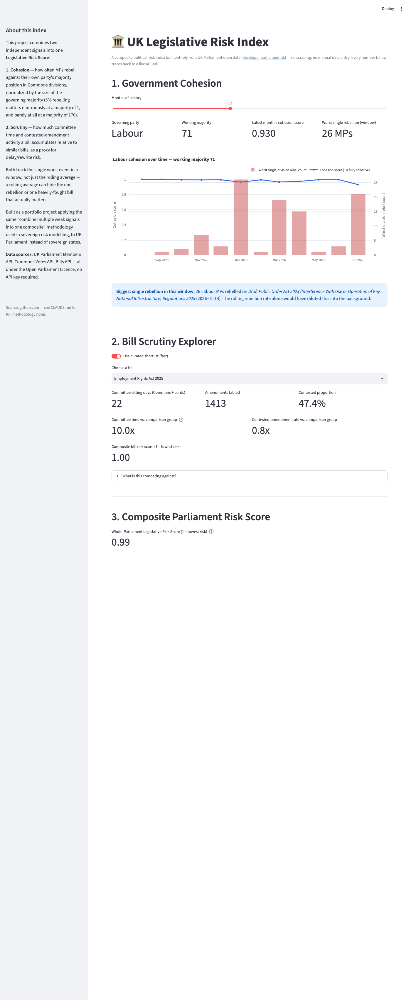

# UK Legislative Risk Index

A composite political-risk index built entirely from UK Parliament open data
([developer.parliament.uk](https://developer.parliament.uk/)). No scraping,
no manual data entry, every number traces back to a live API call.

**[Live demo](https://uk-legislative-risk-index-tcdkpz6o3rdvognosbhw4x.streamlit.app)**,
built by [Alfie Pearson-Rogers](https://github.com/alfierogers1023).



## What it measures

Two independent signals, combined into one score:

- **Cohesion**: is the governing party holding together? Measured from
  Commons division (vote) data, how often MPs rebel against their own
  party's majority position, normalized by the size of the governing
  majority (5% rebelling matters enormously at a majority of 1, and barely
  at all at a majority of 170). Also tracks the single worst rebellion in
  a window separately from the rolling average, since an average can hide
  the one event that actually matters.
- **Scrutiny**: how much legislative friction (committee time, contested
  amendments) is a given bill facing relative to similar bills, as a proxy
  for delay/rewrite risk.

Combined into a **Legislative Risk Score**, at both a whole-Parliament level
and a per-bill level.

Validated against real historical events, not just spot-checked on
synthetic data. For example, the dashboard's tail-event tracker correctly
surfaces the well-documented 59-MP Conservative rebellion on the Safety of
Rwanda Bill (17 January 2024) and shows the Employment Rights Act 2025 (a
known heavily-contested bill) at 22x the committee time of a comparison
group.

## Try it

```bash
pip install -r requirements.txt
streamlit run app.py
```

Opens a dashboard with:
1. **Government Cohesion**: monthly trend chart, working majority, and the
   worst single rebellion in the selected window.
2. **Bill Scrutiny Explorer**: pick a bill (a curated, fast-loading
   shortlist by default, or browse any current Government Bill) and see its
   committee time / contested-amendment rate versus a comparison group of
   similar bills.
3. **Composite Parliament Risk Score.**

## Data sources

UK Parliament Developer Hub, https://developer.parliament.uk/ (Members
API, Bills API, Commons Votes API). Open Parliament Licence, no API key
needed.

## Structure

```
app.py                Streamlit dashboard (the main deliverable)
config/               API endpoint config
src/data_clients/     Thin wrappers around each Parliament API
src/indices/          Cohesion, scrutiny, and composite index logic
src/reporting.py       Shared reporting helpers (used by app.py and the notebook script)
src/utils/            Shared helpers (caching, retrying transient API errors)
scripts/refresh_cache.py  Regenerates data/raw/ (see below)
data/raw/              Committed pre-baked cache, deliberate, not an accident (see
                       scripts/refresh_cache.py and .github/workflows/refresh-cache.yml).
                       Streamlit Community Cloud's filesystem is ephemeral, so this
                       cache is what makes cold starts fast instead of a multi-minute
                       live refetch.
data/processed/        Generated chart/CSV output (gitignored, regenerated on run)
notebooks/             Static PNG/CSV visualisation script
tests/                 Tests for data clients and index logic (run against the live API)
```

See `CLAUDE.md` for the full build rationale, methodology decisions, and
known limitations.

## Setup

```bash
python -m venv venv
source venv/bin/activate  # or venv\Scripts\activate on Windows
pip install -r requirements.txt
python -m pytest tests/    # optional: runs against the live API
streamlit run app.py
```

## License

MIT, see [LICENSE](LICENSE).
